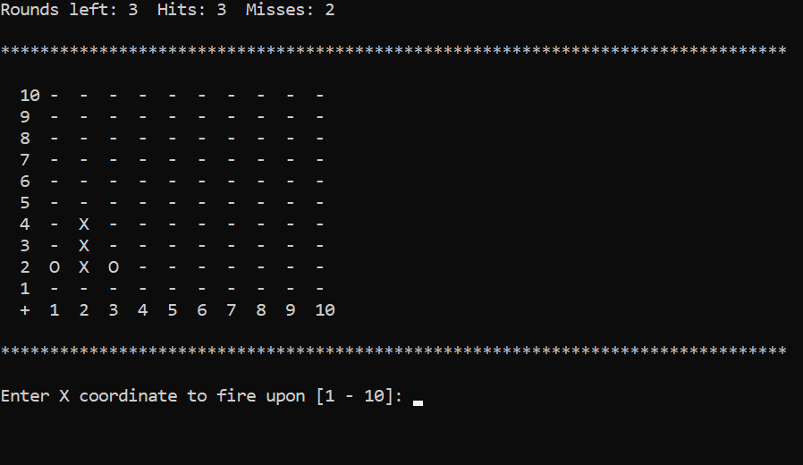

# Battleship

A simple Battleship-like console console game built in C#. The enemy ship is hidden in the fog, and you only have 8 rounds to sink her. Can you bring glory to yourself and your fleet?

# Instructions to run the code locally

1. Download the code from the GitHub [repository](https://github.com/et-codes/battleship).
1. Open `.\BattleshipApp\BattleshipApp.sln` in your IDE and run the app.

## Author

Eric Thornton | [LinkedIn](https://www.linkedin.com/in/ethornton/) | [Twitter](https://twitter.com/eric__thornton)
